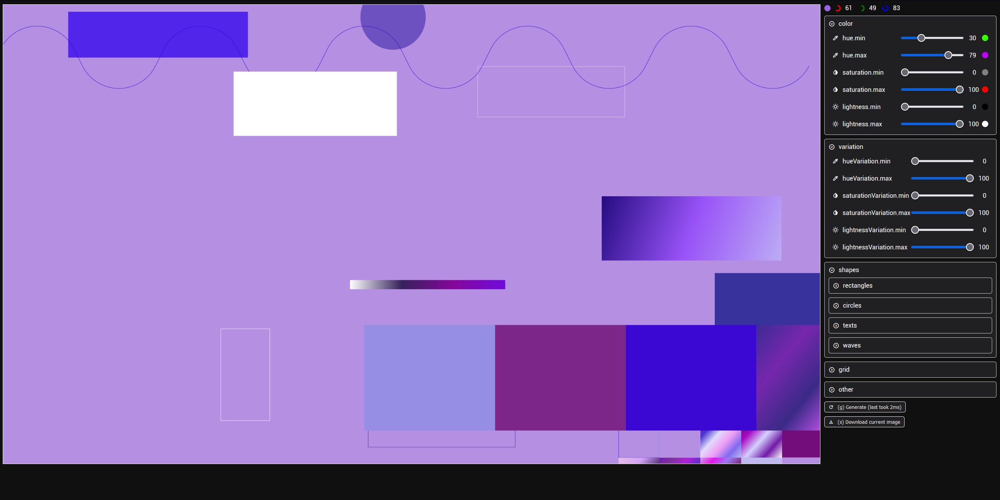

# How to run

```bash
npm install
```

```bash
npm start
```

## How to use

- The right panel gives you the options to change the settings of the generator.
- The left panel shows the generated image.
- You can use the shortcuts `g` to generate a new image, `s` to save the current image and `k` to keep the current items.
- You can enable/disable certain shapes by setting the min and max values of the corresponding sliders.