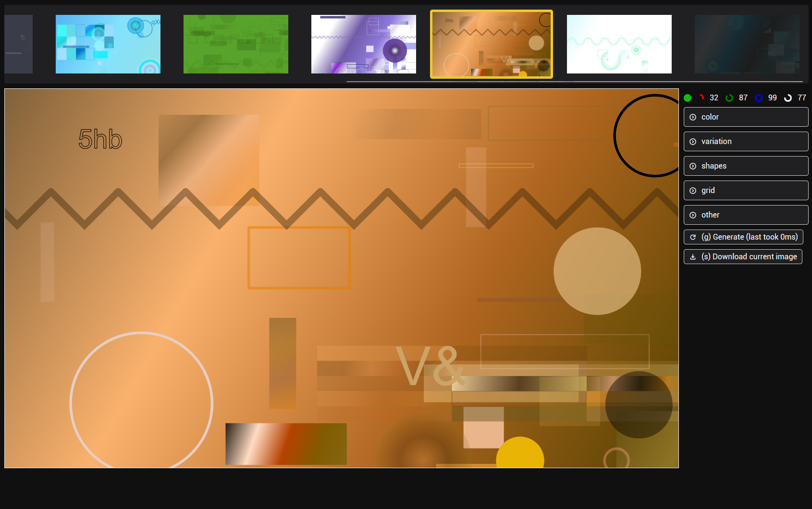

# How to run

```bash
npm install
```

```bash
npm start
```

## How to use

- The right panel gives you the options to change the settings of the generator.
- The left panel shows the generated image.
- You can enable/disable certain shapes by setting the min and max values of the corresponding sliders.

## Shortcuts
- `g` generate a new image
- `s` download the current image
- `k` keep the current items
- `c` keep the current colors
- `a` toggle animation
- `<-` load the previous image from history
- `->` load the next image in from history